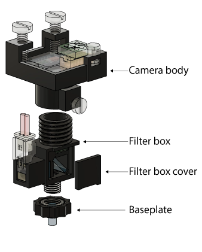

# CHEndoscope Overview
### Contents
1. [Assembling your CHEndoscope](#assembling-your-chendoscope)
2. [Acquiring images with your CHEndoscope](#acquiring-images-with-your-chendoscope) 
	- [Installing acquisition code](#installation-windows)
	- [Running the acquisition software](#running-the-acquisition-software-windows)

3. Analysis of calcium imaging videos: [CHEndoscope-minipipe](https://github.com/jf-lab/chendoscope-minipipe)

# Assembling your CHEndoscope
The CHEndoscope consists of 4 plastic components that can be 3D printed

When printing these parts, we recommend a print resolution of at most 100μm (50μm works best in our hands). Our lab has experimented with various FDM, SLA and material jetting printers, and find that SLA printers such as the Formlabs Form2 render best results. FDM printers often lack the resolution required to render the fine threads and internal details of several CHEndoscope parts. In addition to print resolution, make sure the material you are printing with does not fluoresce or otherwise interfere with the imaging path when exposed to 470nm or 535nm light.

Download CHEndoscope [STL files](./STLs) for 3D printing, or [STEP files](./STEP-files) if you want to modify the base CHEndoscope design.

# Acquiring images with your CHEndoscope

In order to capture images from the CHEndoscope, you will need to install acquisition software that interfaces with the CHEndoscope's Ximea USB camera. This code is compatible with Linux and Windows systems.

## Installation (Windows)

**Dependencies:**

- Python 3.5
  - numpy
  - scipy

1. Install opencv
	- Go to "http://www.lfd.uci.edu/~gohlke/pythonlibs/#opencv", download "opencv_python‑3.2.0+contrib‑cp35‑cp35m‑win_amd64.whl"
	- In a command line, run 
		`pip install "path\to\file\opencv_python‑3.2.0+contrib‑cp35‑cp35m‑win_amd64.whl`

2. Install XIMEA driver - https://www.ximea.com/downloads/recent/XIMEA_Installer.exe

3. Install python bindings for XIMEA driver
	- Download "https://github.com/cyanut/pyximea/raw/master/dist/pyximea-0.0.2-cp35-cp35m-win_amd64.whl"
	- In a command line, run
		`pip install "path\to\file\pyximea-0.0.2-cp35-cp35m-win_amd64.whl"`

4. Test that everything works
	- In a command line, run
		`python -i`
	- then run
		`import numpy,scipy,cv2,pyximea`
	-> python should not complain about any errors

5. Download CHEndoscope acquisition code
	- Go to https://github.com/cyanut/scope-recorder, download the code as zip
	- extract the code to a directory 

6. Download ffmpeg
	- Go to "https://ffmpeg.zeranoe.com/builds/", choose a stable version, 64-bit, static, then download
	- extract the three executable files in the "bin" directory to a new directory

7. Add ffmpeg directory to system path
	- In the windows search bar, type "environment", open the "Edit system environment variable" dialog
	- Click "environment variables ..."
	- In the new dialog, select the "Path" variable, click on "edit"
	- Put in the path for ffmpeg
8. Test
	- In a command line, type `ffmpeg`. It should show a bunch of stuff but not complain about unable to find "ffmpeg"

9. Install nmap (to communicate with the recorder for changing gain, exposure etc.)
	- https://nmap.org/download.html#windows, download a stable version
	- During install, make sure the "NCat" and "Register system path" are selected

10. Install VLC (for video playback)

Installation complete!

## Running the acquisition software (Windows)

1. Open a new cmd window
    - `cd [path for storing video files]`
    - `python "path\to\scope-recorder-master\vid.py"`

2. To change gains/exposure etc:
    - Open a second cmd window and run 
		`ncat -u 127.0.0.1 6557`
    - Then type for example:
		`[set_gain 10]`

